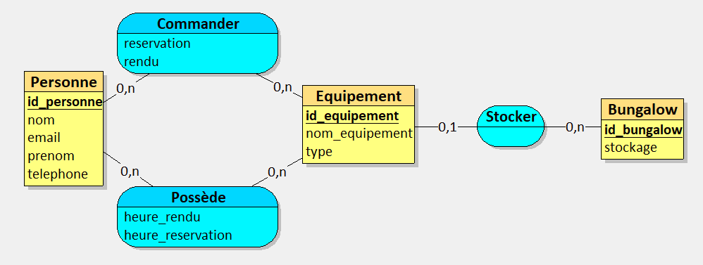

# Methodo-TP

Fourny Nathan  
Artu Florient  
Bonnel Noah  

## Présentation

Nous devons réaliser le MVP (Minimum Viable Product) d'un site web permettant la gestion des stock d'équipement d'un bungalow à la plage ainsi que permettre à un client d'emprunter et de rendre facilement des équipements dans ce bungalow.  

## Réalisation

Pour ce projet nous étions 3 développeurs. nous nous sommes repartis les tâches entre le front-end, le back-end et la partie Base de Donnée.

Front-end : Bonnel Noah
Back-end : Fourny Nathan
Base de Donnée : Artu Florient

## Le projet

Pour ce projet nous avons tout d'abord réalisé un MVC que nous avons ensuite appliqué pour obtenir la Base de Donnée. 

Ensuite nous avons commencé à réaliser les sites internet en html pour l'affichage front-end du site web. Nous y avons appliqué un style graphique afin d'embellir le tout.  
Enfin nous avons réalisé toute la partie back-end avec le serveur. Nous avons utilisés node.js avec les modules express et pg.  

Pour le serveur nous utilisons des **endpoints** permettant de faire le lien entre la page web et la base de donnée. 
