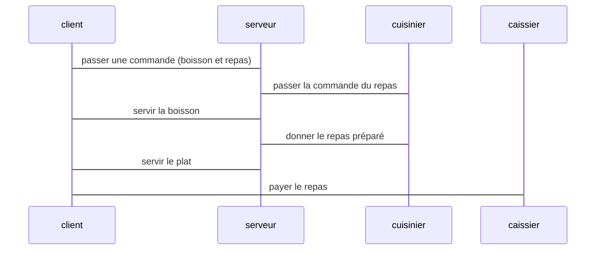

```mermaid
%% Exemple de diagramme de séquences 
  sequenceDiagram
client->serveur: passer une commande (boisson et repas)
serveur->cuisinier: passer la commande du repas
serveur->client: servir la boisson
cuisinier->serveur: donner le repas préparé 
serveur->client : servir le plat
client->caissier: payer le repas
```
